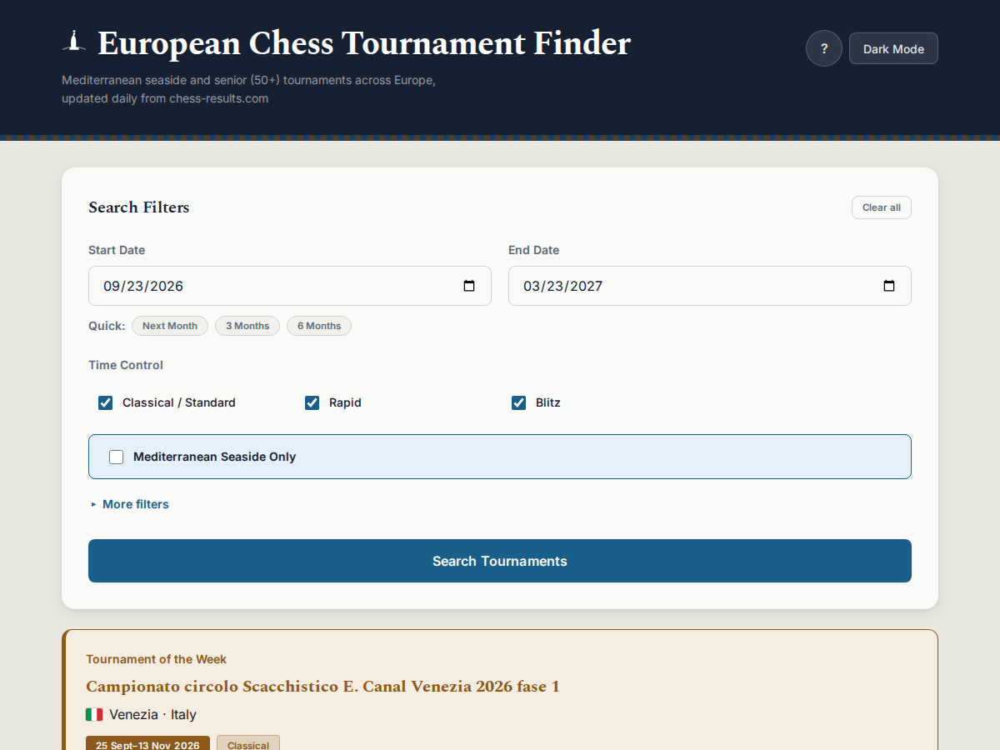
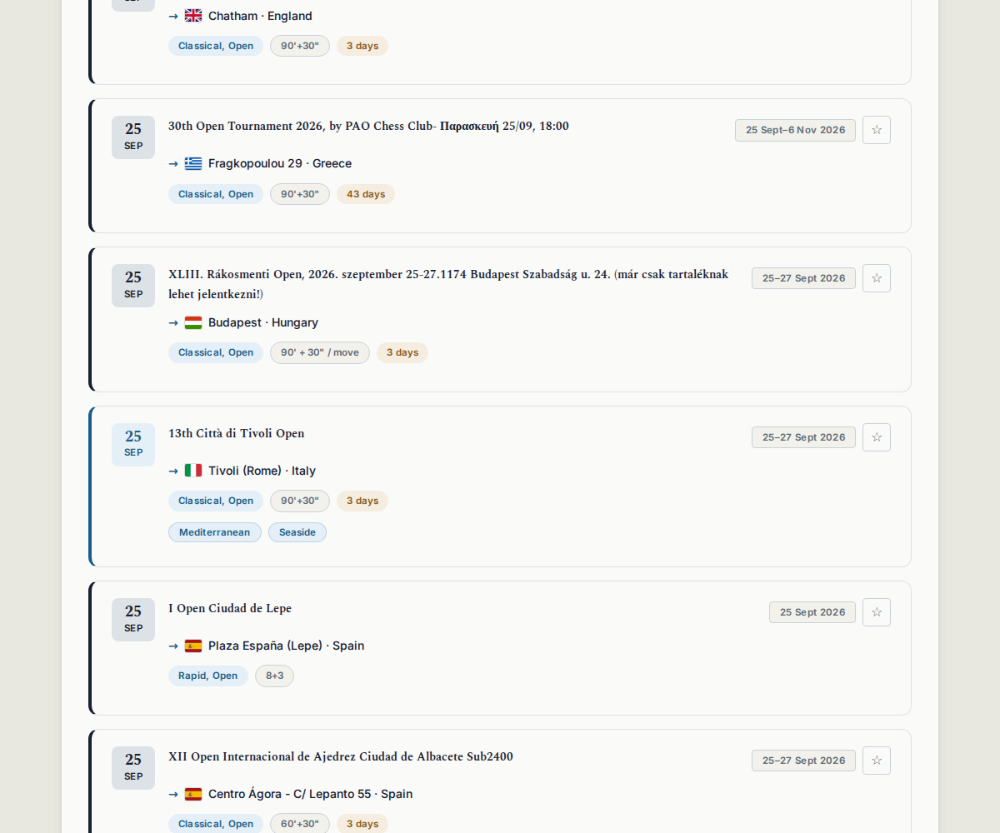

# MedTourney

[](https://github.com/kobolcs/medtourney/actions/workflows/update-tournaments.yml)
[](https://github.com/kobolcs/medtourney/actions/workflows/test.yml)
[](https://github.com/kobolcs/medtourney/actions/workflows/security.yml)

A chess tournament finder for two things chess-results.com's own search doesn't do well: **Mediterranean seaside tournaments** and **senior (50+) categories**. Everything else — open events, women's, youth exclusion, rating ceilings, team formats, duration — is there too, but those two are why this exists.

**Live:** [kobolcs.github.io/medtourney](https://kobolcs.github.io/medtourney/) — no install, no account, results load the moment the page opens.



## Why this exists

chess-results.com lists thousands of tournaments but only lets you filter by federation and date. If you're a chess player who also wants a coastal holiday, or a 50+ player looking for age-appropriate events, you're scrolling through everything by hand. MedTourney scrapes the same source daily and adds the filters that search was missing.

## Features

**Search & filter**
- Mediterranean seaside locations (Barcelona, Nice, Athens, Malta, Split, and more — matched by city, not just country, so "Rome" doesn't also catch a club in Lubartów)
- Senior categories: S50+ and S60+
- Open category, women's tournaments, team tournaments, youth exclusion (or targeting a specific youth age group)
- Time control: Classical, Rapid, Blitz — classified against the actual FIDE 60-move formula from each tournament's real clock settings, not just its name
- Rating ceiling (U1400–U2200) and minimum duration (weekend trips to multi-week stays)
- Multiple countries at once, with unavailable countries automatically hidden as other filters narrow the pool

**Using results**
- Results for the next 6 months load automatically — no click required to see something
- Star tournaments into a shortlist that survives a page reload, then export it as one `.ics` file for Google/Apple/Outlook calendar
- Click anywhere on a card to open it on chess-results.com; hover or focus a card for single-tournament calendar export and a shareable deep link
- A "Tournament of the Week" card highlights a qualifying Mediterranean event automatically, independent of your active filters
- Filter-within-results, sort by date/name/location/country, CSV export of whatever's currently visible



**Everything else**
- Dark mode, keyboard shortcuts (`F1` help, `Ctrl+K`/`E`/`D`/`S`), WCAG 2.1 AA accessibility
- Works on phones — including a fix for a real Chrome-for-Android bug where the sticky search button sat below the visible screen (see `CLAUDE.md` if you're curious)
- Real flag icons, not emoji — emoji flags render as plain two-letter text on Windows and several Linux browsers regardless of which browser you use, since it's the OS that's missing the glyph, not the browser

## Development

**Requirements:** Node.js 20+ (Vite 7 needs it), Python 3.11+ if you're touching the scraper.

```bash
git clone https://github.com/kobolcs/medtourney.git
cd medtourney
npm install

npm run dev          # http://localhost:3000/medtourney/, hot reload
npm run build:vite   # production bundle -> dist/
npm run preview      # serve that production bundle locally
```

```bash
npm run type-check   # tsc --noEmit
npm run lint         # ESLint
```

### Tests

```bash
npm run test:services            # 100 service unit tests
npm run test:integration:services  # 8 tests
npm run test:e2e                 # 68 Playwright tests per browser/device
npm run test:benchmark           # filtering performance (ops/sec)
python3 -m pytest tests/python   # 87 tests (scraper, meta, frontend/backend parity)
```

See [`TESTING.md`](./TESTING.md) for what each suite actually covers and [`ARCHITECTURE.md`](./ARCHITECTURE.md) for how the five services (`CacheManager`, `FilterService`, `DataService`, `ExportService`, `UIManager`) fit together.

## How the data gets here

`TournamentProcessor.py` + `scrape_tournaments.robot` (Robot Framework, Playwright-based) scrape chess-results.com every day at 00:00 UTC via GitHub Actions: search the next 6 months, download the Excel export, keep European results only, write `tournaments_data.json`, commit it to `main`. GitHub Pages then just serves that static file — the web app has no backend and no database.

Run it yourself if you're working on the scraper:

```bash
pip install -r requirements.txt
rfbrowser init
python3 run_scraper.py
```

Or trigger it manually from the [Actions tab](https://github.com/kobolcs/medtourney/actions) → "Update Tournament Data Daily" → "Run workflow", without touching a terminal.

## Contributing

Issues and pull requests are welcome. `CLAUDE.md` has the full architectural conventions and workflow if you're using an AI coding assistant (or just want the same level of detail yourself).

## License

MIT
